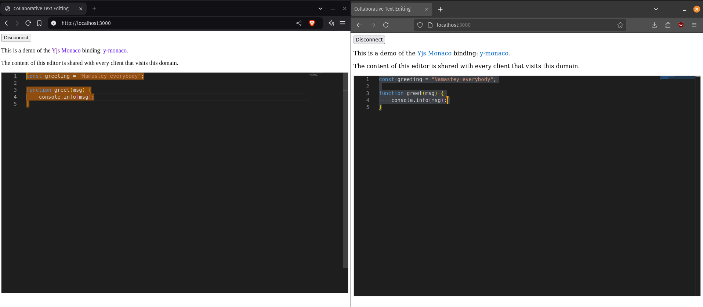

# TextFlow

A collaborative text-editor proof of concept.

---

## Technologies used

- Express.js + Websockets (`ws`)
- MongoDB
- Docker
- Yjs

---

## Installation

```bash
npm install
```

---

## Usage

1. Build the UI with

```bash
npm run build:ui
```

2. Run the server with

```bash
npm run start:server
```

3. Open `http://localhost:3000` in your browser





---

## License

This project is licensed under [MIT License](LICENSE)  